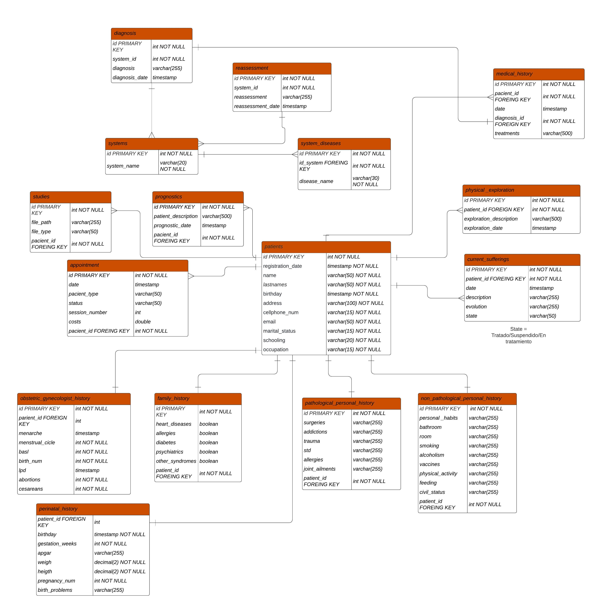
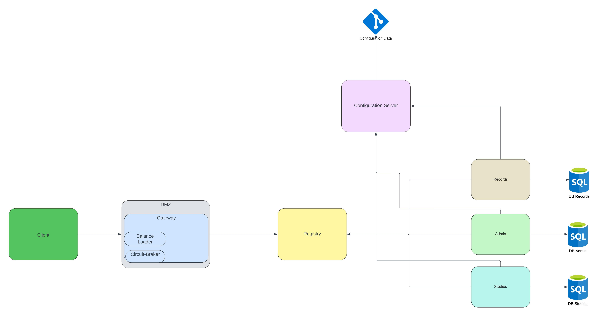

# Microservicios-clinica

Proyecto parte del curso de microservicios en java en colaboración con Metaphorce.

Integrantes:

- Audny Desireé Correa Ceballos ([@Audny738](https://github.com/Audny738))
- Jonathan Gregorio Gómez Benitez ([@JonathanGGB](https://github.com/JonathanGGB))
- Ricardo Alejandro Grimaldo Patiño ([@RicGrimaldo](https://github.com/RicGrimaldo))
- Rodrigo Urtecho Quintal ([@Endorsmoch](https://github.com/Endorsmoch))

## Diagrama Entidad-Relación de la base de datos

## Diagrama de Microservicios Creados

👉Puede probar nuestros microservicios con Postman utilizando las siguientes [peticiones](JSONPetitions.md)
